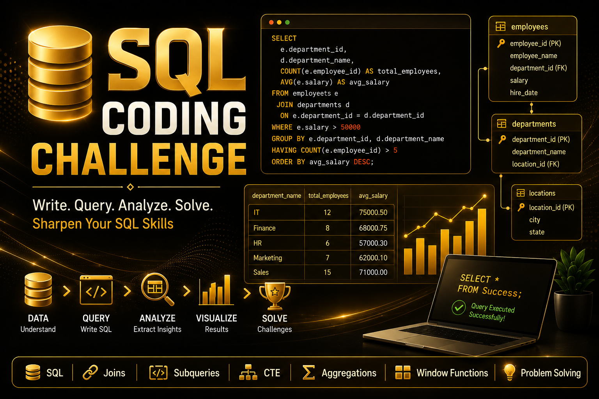

  

 

  
  
  
  
  

  
  
  
  
  
  

 

---
🚀 SQL Coding Challenges Portfolio
Welcome to my SQL Portfolio! This repository contains my SQL coding challenge journey where I practiced database creation, data manipulation, joins, subqueries, and advanced SQL concepts using multiple databases.

---

📊 Projects Overview
| Challenge | Database | Focus Area | Key Concepts |
|-----------|-----------|-------------|---------------|
| 1 | Hospital DB | Database Creation | Tables, Primary Keys, Foreign Keys |
| 2 | Online Bookstore DB | Data Manipulation | INSERT, UPDATE, DELETE |
| 3 | E-Commerce DB | Data Filtering | WHERE Clause, Operators |
| 4 | E-Commerce DB | Aggregations | GROUP BY, HAVING, COUNT |
| 5 | Student DB | Relationship Management | INNER JOIN, LEFT JOIN |
| 6 | Company DB | Advanced Queries | Subqueries, Views |
| 7 | Company DB | SQL Practice | CTEs, Complex Queries |

---

📂 Files Included
SQL coding challenge -1 (Hospital Database)
SQL coding challenge -2 (Online Bookstore)
SQL coding challenge -3 (E-Commerce Database)
SQL coding challenge -4 (E-Commerce Database)
SQL coding challenge -5 (Student Database)
SQL coding challenge -6 (Company Database)
SQL coding challenge -7 (Company Database)

---

🛠 Concepts Practiced
DDL Commands
DML Commands
Constraints
Joins
Aggregate Functions
Subqueries
Views
CTEs
String Functions
Database Relationships

---

🎯 Goal
The goal of this repository is to improve my SQL skills through hands-on coding challenges and real-world database practice.

---

👨‍💻 Author
Suriya U.S
Aspiring Data Analyst

